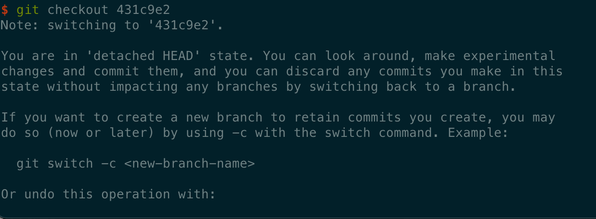
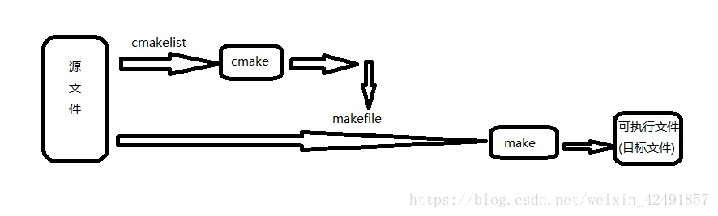

# fastText源码解读学习

不知不觉来到20年12月，开学已经三个月了，期间断断续续做过一些小东西，也在看一些经典的模型，读两篇论文，但是总觉的这样做没有任何意义，基础一点也不扎
实，都是纸上谈兵，真正让做一个项目的话，除了clone他人的代码也似乎没有其他的路途，作为一个计算机专业的学生真是可悲，身边也有不少同学一头扎在论文里，
不知道他们两年内能学到什么，对找工作有什么帮助，有的代码能力简直糟糕，一个源文件走天下，这可能就是以后shitcode的继承者吧。现在我的python也是半吊
子，c++也拿了起来，光看书是没用的，一直想找个项目练练手，最好还是和nlp有关的，找了很久，什么leveldb，stl容器，都不是我想要的，在某天睡了一觉灌了
一杯咖啡之后，大脑似乎被打开来，逛了一下午的知乎，偶遇山石松的一篇回答，直接点醒我，**fasttext==c++ + python + 项目框架 + nlp**，简直是完美
的梦中情人，整个人都精神起来，于是开始学习fasttext的源码，希望自己能够收获满满，不虚此行。

## 万码归宗，git大法

直接clone一个[fstText](https://github.com/facebookresearch/fastText)到本地，然后开始懵逼发呆，以上是错误操作，我们需要整一个最原始的版
本，先读懂这个hello word，之后每次大更新在跟进一下，是不是就很有一种参与项目的真实感呢。

这里就要扯到《GNU 风格的版本号管理策略》

1. 项目初版本时，版本号可以为 0.1 或 0.1.0, 也可以为 1.0 或 1.0.0，如果你为人很低调，我想你会选择那个主版本号为 0 的方式
2. 当项目在进行了局部修改或 bug 修正时，主版本号和子版本号都不变，修正版本号加 1
3. 当项目在原有的基础上增加了部分功能时，主版本号不变，子版本号加 1，修正版本号复位为 0，因而可以被忽略掉
4. 当项目在进行了重大修改或局部修正累积较多，而导致项目整体发生全局变化时，主版本号加 1
5. 另外，编译版本号一般是编译器在编译过程中自动生成的，我们只定义其格式，并不进行人为控制。

这样做，还有有助于加深对git的理解和使用，例如查看git的提交历史,什么命令不知道？使用git log --help 查看详细的使用方式，英文的困难只能自己解决，
这点东西看不了的话直接可以劝退的了。这个是能查到最详细的的使用方式，比你百度的全多了。

使用```git log --reverse```第一条就是初次调教的代码，在github的release页面找到第一个版本对应的commit id



这里出现了新的名词 ```detached HEAD``` ，当直接指向一个游离的commit id，HEAD指向的应该是当前操作的分支，但是直接使用的commit id并非一个具
体的分支，切回master之后git branch也看不到刚刚做的更改，
解决方式，给个具体的分支名称，然后merge push就行了。

```bash
$ git checkout -b test-branch 56a4e5c08

...do your thing...

$ git checkout master
$ git branch -d test-branch
```

写着写着就飘了，明明是看源码来着，准备工作差不多了，开始看fastText的hello world了

## v0.1.0

作者贴心的给出了tutorial，由监督学习的和无监督学习的两部分组成

git clone下来之后切换到对应到分支，参照说明，直接make之后获得可执行文件。桥豆麻袋，先跑偏一下，make这一块，最近在使用clion的时候一直遇到cmake
的东西，但是傻瓜式的编译运行我并没太注意cmake有什么用，下面介绍一下make和cmake之间有什么关系

写程序大体步骤为：

1. 用编辑器编写源代码，如.c文件
2. 用编译器编译代码生成目标文件，如.o
3. 用链接器连接目标代码生成可执行文件，如.exe

但如果源文件太多，一个一个编译时就会特别麻烦，于是人们想到，为什么不设计一种类似批处理的程序，来批处理编译源文件呢，于是就有了make工具，它是一个自
动化编译工具，你可以使用一条命令实现完全编译。但是你需要编写一个规则文件，make依据它来批处理编译，这个文件就是makefile，所以编写makefile文件也
是一个程序员所必备的技能。

对于一个大工程，编写makefile实在是件复杂的事，要记住各种命令可不容易，大点的工程源文件数量也不少，其中的依赖关系理不清，于是人们又想，为什么不设计
一个工具，读入所有源文件之后，自动生成makefile呢，于是就出现了cmake工具，它能够输出各种各样的makefile或者project文件,从而帮助程序员减轻负担。
但是随之而来也就是编写cmakelist文件，它是cmake所依据的规则。所以在编程的世界里没有捷径可走，还是要脚踏实地的。

```bash
makefile基本格式，注意命令之前必须是制表符，不接受4个空格，clion中自己调整
# 否则报错*** missing separator.  Stop.
目标：依赖
    命令（依赖）-> 目标
main: main.o sum.o
    g++ main.o sum.o -o main
main.o: main.cpp
    g++ -c main.cpp
sum.o: sum.cpp
    g++ -c sum.cpp
#make 只编译和上次被修改过的文件，
```

所以流程如下：


回归正题，编译之后得到一个fastText二进制文件，直接运行可以看到

```c
>> ./fasttext
usage: fasttext <command> <args>

The commands supported by fasttext are:

supervised     train a supervised classifier
test           evaluate a supervised classifier
predict        predict most likely labels
predict-prob   predict most likely labels with probabilities
skipgram       train a skipgram model
cbow           train a cbow model
print-vectors  print vectors given a trained model
```

python实现这种功能很简单，安装调用argparse就行，但是c++的第一遇到，那么不妨冲这里下手，看看怎么写出漂亮命令行文档，顺带了解一下fasttext初期的
设计的理念，有哪些具体的功能，好像本末倒置了啊。

### 命令行帮助文档的生成

观察makefile，可以看到存在一个src/arg.cc的原文件，属于fasttext的依赖，八成是它控制的。结合main.cc和arg.cc调用者和被调用者对应的头文件来分析
一下逻辑。顺便跟着造轮子，建立makefile，src，readme

首先遇到了一条神奇的语句```std::vector<std::string> args(argv, argv + argc);```，其实这是vector的一种初始化方式，argv+argc初看也很懵，
但是一定见过vector<int> v(a.begin(),a.end())这种初始化方式，argv是数组名，调用的时候自动转化为指针，argc是int，表示参数的数量，指针和int
相加相当于指针后移，和上面的初始化并没有什么区别，这条语句就是把将命令行参数初始化成了vector。

当使用使用容器初始化的时候，```vector<int> v{1,2,3,4,5,6,7,8,9};```，每次make都会遇到 error: expected ';' at end of declaration，
百度就是个垃圾，查了半个小时，语法都背下来了也没找到错误，最后还是google到了答案，g++ 默认使用的是 C++03，容器是C++11的语法，make里面立一个
flag **-std=c++11** 就行了，真是盖了帽了，我的老百度。

### Args类

fasttext是深度学习的库，必然和训练模型有关，训练是最重要的功能，所以开始解刨训练的代码

```c
void train(const std::vector<std::string> args) {
  std::shared_ptr<Args> a = std::make_shared<Args>();
  a->parseArgs(args);
  FastText fasttext;
  fasttext.train(a);
}
```

看到```std::shared_ptr<Args> a = std::make_shared<Args>();```一定是满头包，这是什么？在c++中使用new出来的对象是不会自动释放占用的内存
的，需要配合delete来使用，但是在逻辑复杂的项目中很难在正确的位置配对使用，导致内存泄漏，无法申请该内存，或者指针非法使用。shared_ptr是智能指针模
版，方便资源的管理，自动释放没有指针引用的资源。std::shared_ptr的大小是原始指针的两倍，因为它的内部有一个原始指针指向资源，同时有个指针指向引用计
数。使用引用计数来标识是否有多余指针指向该资源。make_shared起到new的作用可以一次将需要内存分配好。

Args类是遇到的第一个类，从args.h可以一窥究竟。首先是正常的头文件宏定义，避免重复引用，多次声明，然后是定义了一个namespace，分隔了全局命名空间，
避免命名冲突，namespace可以进行多次的定义，相当于向同一个命名空间添加成员。

enum class 强类型枚举，在标准C++中，枚举类型不是类型安全的。枚举类型被视为整数，这使得两种不同的枚举类型之间可以进行比较。enum class此种枚举为
类型安全的。枚举类型不能隐式地转换为整数；也无法与整数数值做比较。否则会发生编译错误。枚举类型，未显式初始化的话默认是之前的值加一。

作者使用了默认初始化，并未提供其他初始化的方式，可能之后版本会有。初始化了大量的模型参数，其中有一项是thread，看来是要涉及到多线程了。初次之外，
还定义了解析参数，根据不同的参数，设置不同的模型参数，详细的说明文档，保存函数，读取函数。

伴随着头文件的丰富，我们需要不断的更新makefile，体积越来越庞大，.o也越来越绕，所以直接使用一个变量来存放所有的main的依赖目标文件。

### fasttext类

该类中有40个左右的函数，我们从main中切入，发现只使用了默认初始化函数和train函数，逐个击破他们。

初始化```Fasttext fasttext```，看到这里，突然有个疑问，这里为什么不使用new，平时我们为什么在使用new？
> 插一句话，突然发现github上的超链接跳转不正常，原因是本地大写的文件改成小写之后上了git自动忽略掉了，git默认对于文件名大小写是不敏感的，设置git 
>config core.ignorecase false，注意此时github上会同时出现这两个文件夹，但是你pull只能拿到改过之后的，无法删除github上的那个，这时候千万
>不要着急，只需要把这个文件夹拿出仓库，push一下，远程端两个都会消失，然后再放回仓库里面，在push一下，完美解决问题。
> git remote prune origin 处理远程已经没有的分支，本地还能看到的分支，可以在github上手动删除分支
new实际上做了三件事：在堆上一块内存空间、调用构造函数、返回正确的指针。因此new出的对象可以在函数中直接返回，不会因为堆的释放而消失，但是也带来了
>相应的问题，使用完成之后必须删除，否则会出现内存泄漏的问题，所以多使用智能指针来保证安全。

至此发现初始化还依赖其他定义的比较基础的类，没有他们是无法进行的，因此，先观察一下基础类的实现方式，学习类的常用写法。

### Vector类

c++11中自带容器vector，使用的时候需要先```#include <vector>```，自己写一个是否会发生冲突呢？答案是不会的，头文件搜索规则：**尖括号**告诉
编译器在一个或者多个标准系统目录中找到文件 /usr/include /usr/local/include；即系统头文件所在的目录，如果没有，也不会检索当前文件所在路径，
并将报错。**双引号**编译器先到当前目录查找头文件或文件名中指定的其他目录，如果没找到在到标准系统目录查找。usr是系统自带的，usr/local是用户自己的，
mac没有/usr/include，通常安装三方的时候在/usr/local/include中。
接下来进入正题，编写Vector类。

```c
#include <cstdint>
#include <iostream>

#include "real.h"

namespace fasttext {

class Matrix;
class QMatrix;

class Vector {

  public:
    int64_t m_;
    real* data_;

    explicit Vector(int64_t);
    ~Vector();

    real& operator[](int64_t);
    const real& operator[](int64_t) const;

    int64_t size() const;
    void zero();
    void mul(real);
    real norm() const;
    void addVector(const Vector& source);
    void addVector(const Vector&, real);
    void addRow(const Matrix&, int64_t);
    void addRow(const QMatrix&, int64_t);
    void addRow(const Matrix&, int64_t, real);
    void mul(const QMatrix&, const Vector&);
    void mul(const Matrix&, const Vector&);
    int64_t argmax();
};

std::ostream& operator<<(std::ostream&, const Vector&);

}
```

class Matrix;是类声明，在c++prime的类类型中有提到，

explicit 修饰构造函数时，可以防止隐式转换和复制初始化

real等同于float，typedef float real;

int64_t,int32_t,可以理解为typedef的缩写，表示它是通过typedef定义的，而不是一种新的数据类型。因为跨平台，不同的平台会有不同的字长，所以利用
预编译和typedef可以最有效的维护代码。这样做位数是明确的，没有歧义。size_t在不同平台可能有差异，尽量少用。

析构函数：销毁非static函数成员，无返回值，也不接受参数。因此也不能进行重载，具有唯一性。

重载：和定义函数一样，返回值，参数，必须和类类型相关，无法改变运算符的优先级，重载下标运算符[]返回的是引用，这样才能修改内容生效。注意返回引用的时候
不要关联到栈内的变量，一般形参都是引用，或者new块空间也可以，但是要注意内存泄漏问题。

> gitignore，需要先把本地要忽略的文件删除或转移到仓库外部，push之后，再转移回来，再push一次，远程端才会消失。

对于编程人员来说，double和float的区别是double精度高。但double消耗内存是float的两倍，double的运算速度比float慢得多，能用单精度时不要用双精度
以省内存，加快运算速度。

### Matrix和Qmatrix

matrix.h也用到了Vector类，发现二者之间相互调用，这样的问题可以使用前置声明来解决，具体做法是头文件中不进行include，只前置声明，cpp中include
对应头文件。

matrix矩阵使用一维数组实现，new float[m*n]

构造函数，直接初始化和复制初始化，直接初始化，就是使用构造函数，定义在申请了对象空间之后如何对各个子空间进行初始赋值，称他们为直接初始化是很贴切的，
应为他就是最为普通的初始化，是构建一个完整对象的一个过程——先将空间申请好，然后给各个子空间（数据属性）进行相应的赋值。复制初始化，
特点特别之处在于“复制”二字，核心意义就是，我通过对一个已有对象的完全复制，来构建对象。它的过程可以理解成这样——先申请空间，然后将被复制的对象
的所有内容全部复制过去，就形成了这个对象。所以，要明确，两种初始化的方式，都是一构造函数的形式存在的。区别在于他们的参数方面，复制初始化，表达的就是
对一个已有同类型的对象进行复制，那么这种构造函数就应该使用某个对象来进行复制，同时因为，C++参数的传递默认都是值传递，要声明使用引用的方式（要不然就又复制了一次了
并且是const类型的。要进行=的重载

### Dictionary类

构造vocab，word2int字典等操作

# 重零开始

## main

已经剖析到了fasttext之后，一环扣一环，渐渐跑到了qmatrix上，这一块是量化压缩的内容，应该是一种对模型训练的优化提速的方式，用到了kemeans算法。
但是这时候已经忘记了要做什么了，于是打算回到fasttext的train上，对每个类只做一个大致的了解，先暂时不深究语法问题，不然恐怕到找工作也看不完，c++
打算跟着侯捷的stl剖析学习

## fasttext

在main中，实例化了fasttext，并使用了fasttext的train，这里涉及到了两个函数，默认构造和train，```FastText::FastText() : quant_(false) {}```
**quant_** 是否使用量化的方法，默认false。train接受唯一的参数 Args，是之前声明的类，用于接受用户输入的指令。使用args初始化dictionary，获得
智能指针dict_，检测输入文件的路径的合法性，创建文件流ifs，读取数据dict_->readFromFile(ifs)，判断是否有与训练的向量，如果存在，则读取复制给input_，
否则，直接使用均匀分布初始化input_，```input_->uniform(1.0 / args_->dim);```，初始化为0回导致同步更新的问题，梯度下降不再work，学习到的
特征单一。接下来判断是sup监督分类模型还是skip/cbow词向量模型，据此设置output_的格式。然后判断是否使用多线程进行训练，此处多线程还没打算继续深入，
暂且先跳过，直接使用单线程训练```trainThread(0);```

trainThread(int)是具体的训练函数，涉及到Model类```Model model(input_, output_, args_, threadId);```，threadId做种子，
```c++
Dictionary::Dictionary(std::shared_ptr<Args> args) : 
                args_(args),word2int_(MAX_VOCAB_SIZE, -1), size_(0), nwords_(0), nlabels_(0),
                ntokens_(0), pruneidx_size_(-1) {}
```


